# Lab-07 : Explore Microsoft Sentinel 

## Lab scenario
In this lab you will walk through the process of creating an  Microsoft Sentinel instance.  You will also set up the permissions to ensure access to the resources that will get deployed to support  Microsoft Sentinel.  Once this basic setup is done you will walk through the steps for connecting Microsoft Sentinel to your data sources, set up a workbook, and do a brief walk-through of some of key capabilities available in Microsoft Sentinel. 

## Lab objectives

In this lab, you will complete the following tasks:

+ Task 1: Create a Microsoft Sentinel instance
+ Task 2: Built-in Microsoft Sentinel roles
+ Task 3: Data connector to your instance of Microsoft Sentinel
+ Task 4: Explore on capabilities available in Sentinel

## Estimated timing: 60 minutes

## Architecture diagram

.png)
  
## Task 1:  Create a Microsoft Sentinel instance

1. In the Azure portal, in the **Search resources, services, and docs** search for **Microsoft Sentinel (1)** then select **Microsoft Sentinel (2)** from the search results.  

   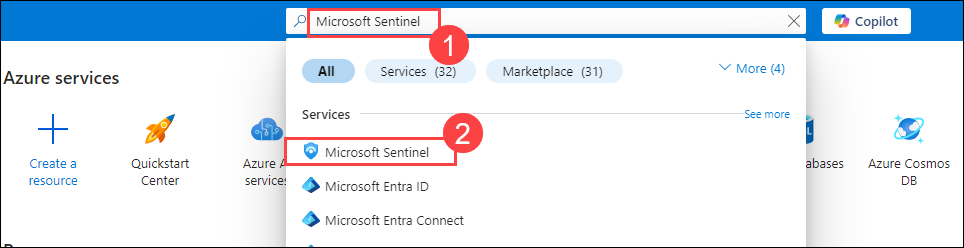

1. From the Microsoft Sentinel page, select **+ Create**.

   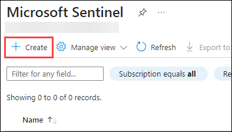

1. From Add Microsoft Sentinel to a workspace, select **+ Create a new workspace**.

   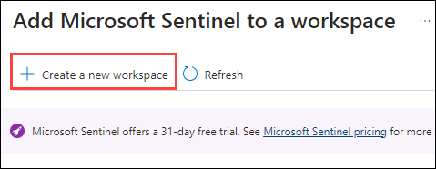

1. From the basics tab of the Create Log Analytics workspace, enter the following details and then click on **Review + Create (5)**.

    | Setting | Action |
    | -- | -- |
    | Subscription |  **Select the given subscription (1)**  |
    | Resource group | Select **SC900-ResourceGroup (2)** |
    | Name | **SC900-LogAnalytics-workspace-<inject key="DeploymentID" enableCopy="false"/> (3)** |
    | Region | leave this default **(4)** |
    |||

    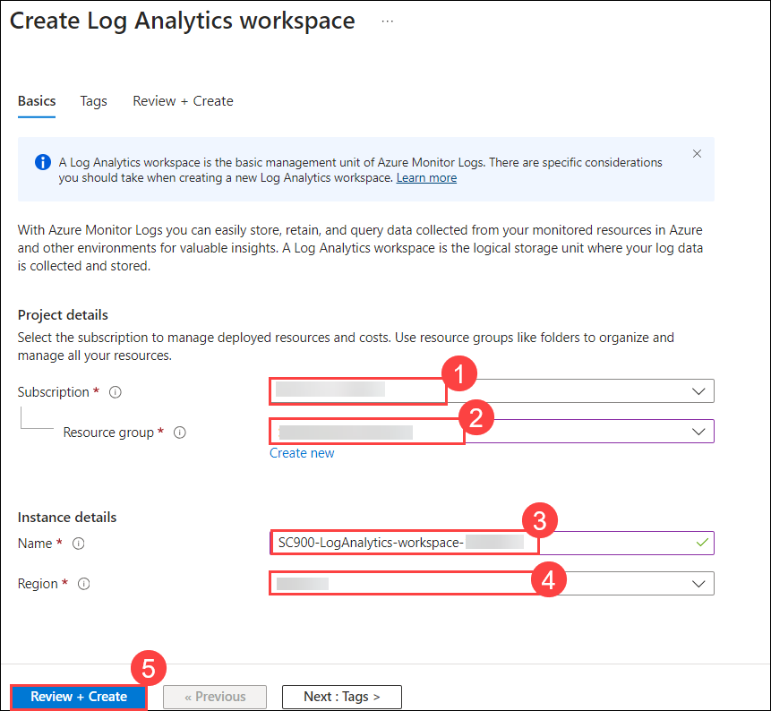

1. Once the Validation is passed, then select **Create**.

1. Navigate back to **Add Microsoft Sentinel to a workspace**, If you don’t see the new workspace listed, select **Refresh**. Then select newly created workspace **SC900-LogAnalytics-workspace (1)** and then click on **Add (2)**.

   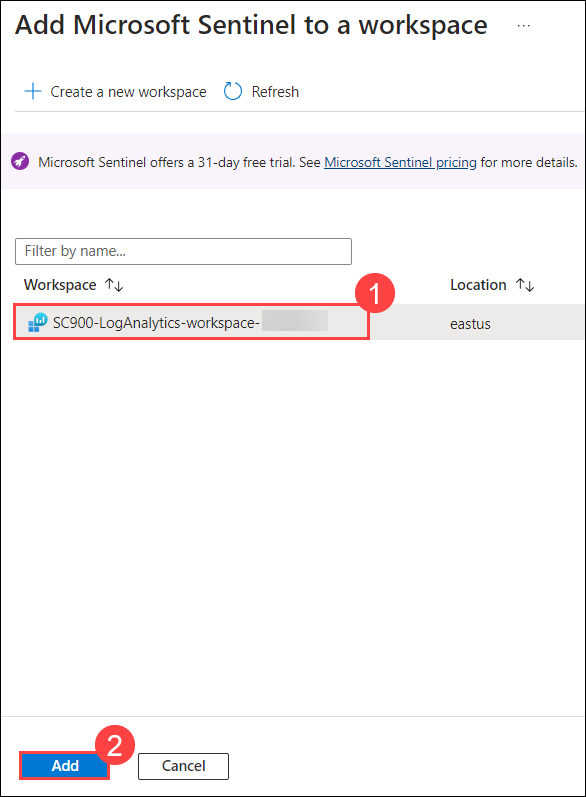

1. Once the new workspace is added, the *Microsoft Sentinel | News & guides* page will display, including that the Microsoft Sentinel free trial is activated. Select **OK**  Note the three steps listed on the Get started page.

   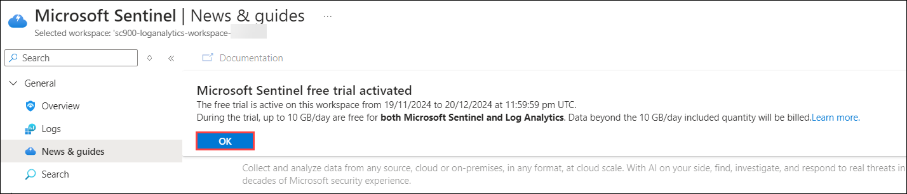

1. Keep this page open, as you will use it in the next task.
   
> **Congratulations** on completing the task! Now, it's time to validate it. Here are the steps:
> - If you receive a success message, you can proceed to the next task.
> - If not, carefully read the error message and retry the step, following the instructions in the lab guide. 
> - If you need any assistance, please contact us at labs-support@spektrasystems.com. We are available 24/7 to help you out.

<validation step="e6ffbb4b-3ecb-42af-9dcd-0c1044de2a66" />
    
## Task 2: Built-in Microsoft Sentinel roles

With the Microsoft Sentinel instance created, it is important that users that will have responsibility to support Microsoft Sentinel have the necessary permissions.  This is done by assigning the designated user the required role permissions. In this task, you'll view the available, built-in Microsoft Sentinel roles.

1. In the **Search resources, services, and docs** search for **Resource groups (1)** then select **Resource groups (2)** from the search results. 

    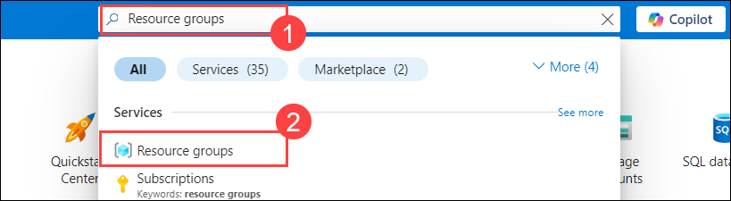

1. From the Resource groups page, select the resource group  with Microsoft Sentinel, **SC900-ResourceGroup**.

    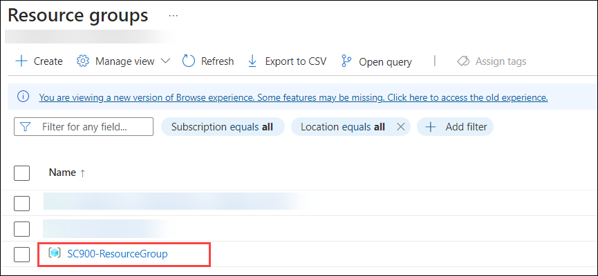
   
     >**Note**: Working at the resource group level will ensure that any role that is selected will apply to all the resources that are part of the Microsoft Sentinel 
    instance that was created in the previous task.

     >**Note**:  For the Azure subscription provided to you by the Authorized Lab Hoster, a role has been defined that will give you access to manage all necessary resources as shown in the description. It is important, however, to understand the available Sentinel specific roles. Note the current role is Owner.

     >**NOTE:**  As a best practice you should assign the least privilege required for the role.  As a reference, review permissions in Azure Sentinel: 
      https://docs.microsoft.com/en-us/azure/sentinel/roles
   
1. Select the **Access Control (IAM) (1)**, select **View my access (2)** to confirm the **Owner (3)** role has been added, then close the window by select the **X (4)** on the top-right corner of the window.

    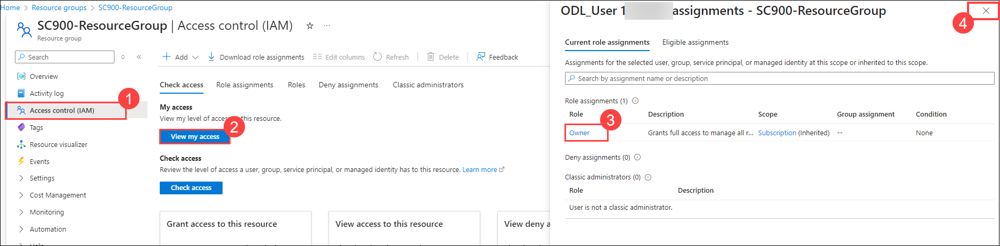
   
     >**Note**: For the Azure subscription provided to you by the Authorized Lab Hoster, a role has been defined that will give you access to manage all necessary resources, as  shown in the description. It is important, however, to understand the available Sentinel specific roles.
   
     >**Note the current role is Owner.**

1. From the Access control page, select the **Roles (1)** tab on the top of the page.

    - In the search box, enter **Microsoft Sentinel (2)** to view the built-in roles associated with Microsoft Sentinel.

    - From any of the roles listed **(3)**, select **View (4)** to view the details of that role. As a best practice you should assign the least privilege required for the role. 

    - Close the window by selecting the **X (5)** on the top-right corner of the window.

      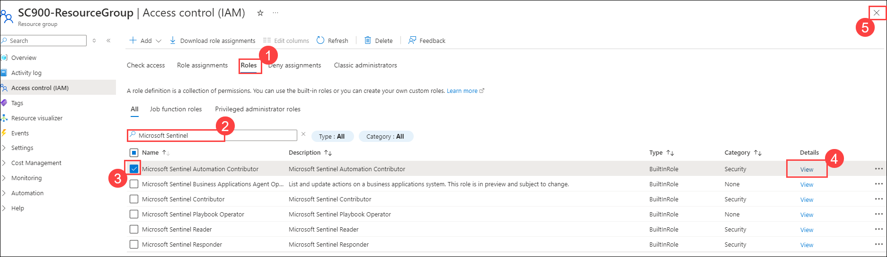

1. From the top left corner of the window, just below the blue bar where it says Microsoft Azure, select **Home** to return to the Azure services home page.

    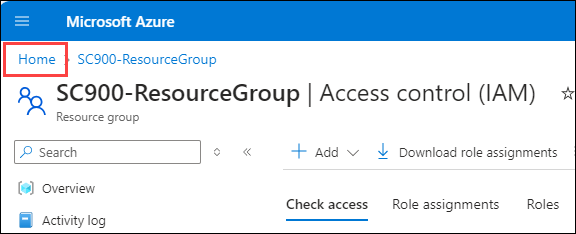

> - **Congratulations** on completing the task! Now, it's time to validate it. Here are the steps:
> - If you receive a success message, you can proceed to the next task.
> - If not, carefully read the error message and retry the step, following the instructions in the lab guide.
> - If you need any assistance, please contact us at labs-support@spektrasystems.com. We are available 24/7 to help you out.

<validation step="6ef79789-58a4-4dc4-a65e-8b5aacef02c1" />

## Task 3: Data connector to your instance of Microsoft Sentinel

In this task you will walk through the steps involved in setting up a data connector to your instance of Microsoft Sentinel and selecting a built-in workbook templates to allow you to quickly gain insights across your data as soon as you connect a data source. Note: Azure lab subscriptions may experience greater than normal delays in connecting to a data source and/or visualizing data.

1. In the **Search resources, services, and docs** search for **Microsoft Sentinel (1)** then select **Microsoft Sentinel (2)** from the search results.

   

1. From the Microsoft Sentinel page, select the workspace you created with the instance of Microsoft Sentinel, **SC900-LogAnalytics-workspace-<inject key="DeploymentID" enableCopy="false"/>**.

   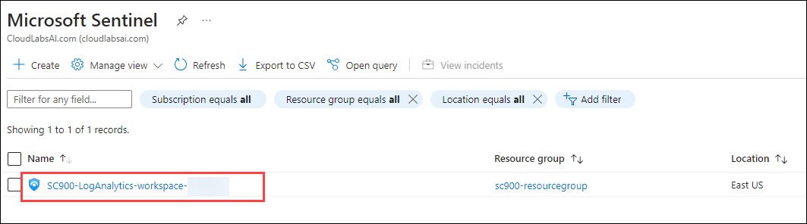

1. The first step with Microsoft Sentinel is to be able to collect data. From the left navigation panel select **Data connectors**, listed under configuration.

   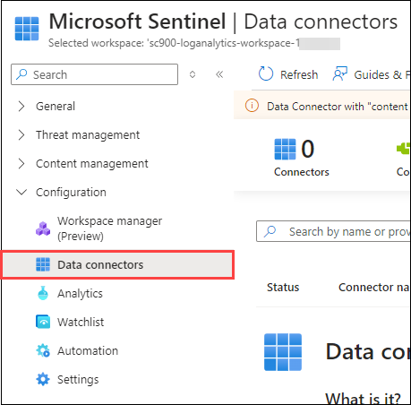

1. On the **Microsoft Sentinel | Data connector** page scroll down and select **Go to Content hub**.

   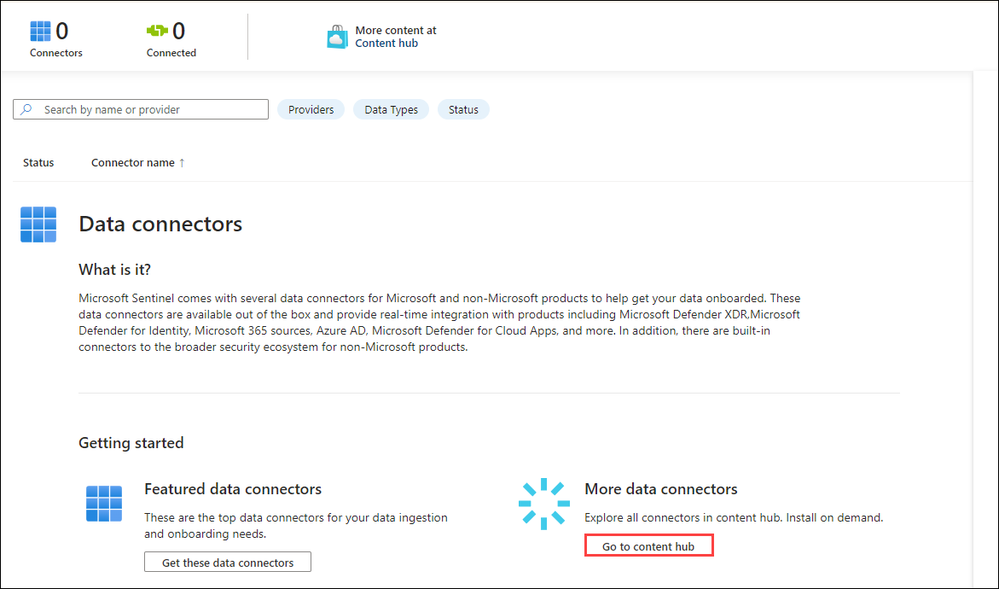

1. On **Content hub** page in  the Search bar, search for **Microsoft Defender for Cloud** and then from the list select **Microsoft Defender for Cloud**.

    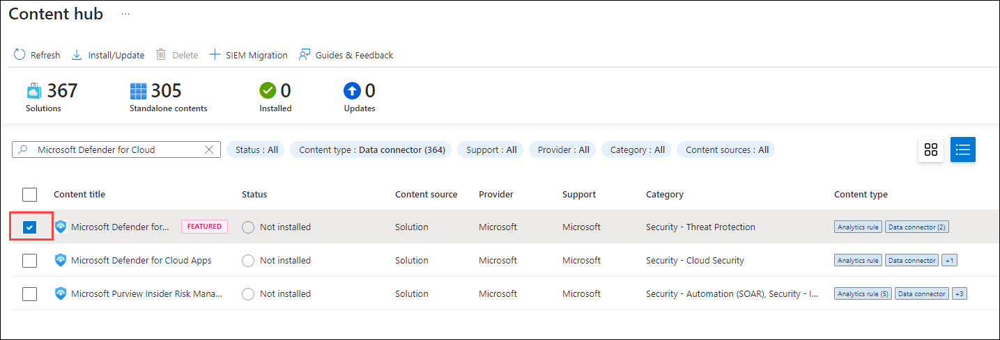

1. Click **Install**.

   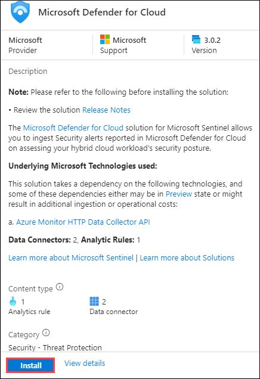

1. Once installation process is done, navigate back to **Microsoft Sentinel | Data connector** page and refresh the page to get **Microsoft Defender for Cloud** option.

   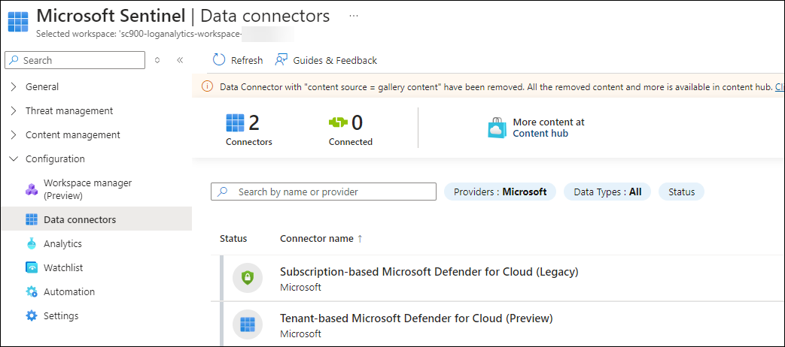

1. On the **Microsoft Sentinel | Data connector** page , select **Subscription-based Microsoft Defender for Cloud (Legacy) (1)**. On the **Subscription-based Microsoft Defender for Cloud (Legacy)** window opens. Review the description then Select **Open connector page (2)**.
 
    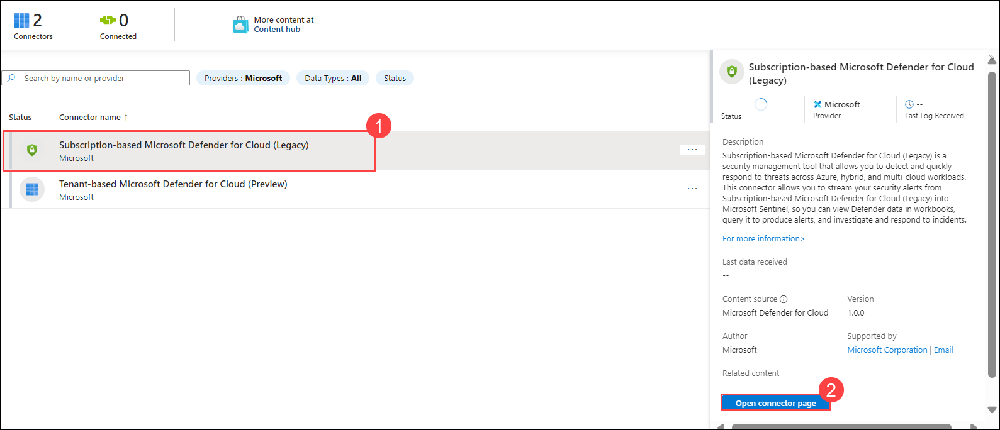

1. From the **Subscription-based Microsoft Defender for Cloud (Legacy)** connector page, review the Description on the left side of the window.

   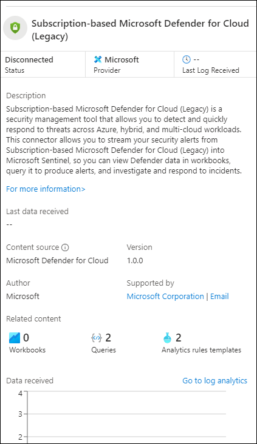

1. The instructions tab in the main window, provides the prerequisites. Review the instructions and configuration information.

1. From the configuration section, select listed subscription, select your **azure subscription (1)** so that a checkmark appears in a blue box and then select **Connect (2)** (the connect option is shown above the search box).

   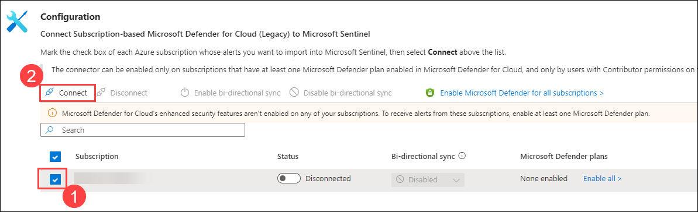

1. If a Connect window appears, select **OK**.

1. In the status column, next to the subscription you should see that status update to Connected.  Don't worry if you don't see connected status in the window on the left side of the page, do NOT refresh the browser.
   
1. Return to **Microsoft Sentinel** and from the Microsoft Sentinel page, select the workspace you created with the instance of Microsoft Sentinel, **SC900-LogAnalytics-workspace-<inject key="DeploymentID" enableCopy="false"/>**.

   
       
1. From the left navigation panel, select **Analytics** under Configuration panel.

   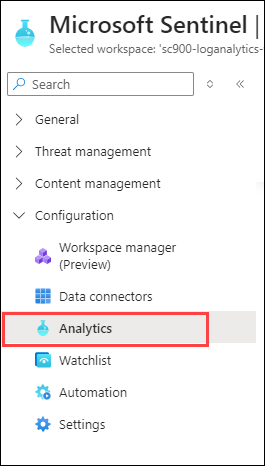

1. Navigate to **Rule templates (1)** tab, search for **Detect CoreBackUp Deletion Activity (1)** then select the **Detect CoreBackUp Deletion Activity (3)** from related security alerts rule. A window that opens on the right, that provides information about the rule and what it does. Select **Create rule (4)**.

    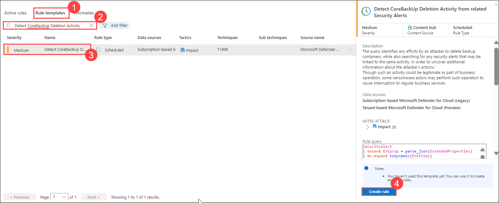 

1. Although the details of the rule logic are beyond the scope of the fundamentals, go through each tab in the rule creation to view the type of information that can be configured.

1. When you reach the **Review + create (1)** tab, select **Save (2)**.

    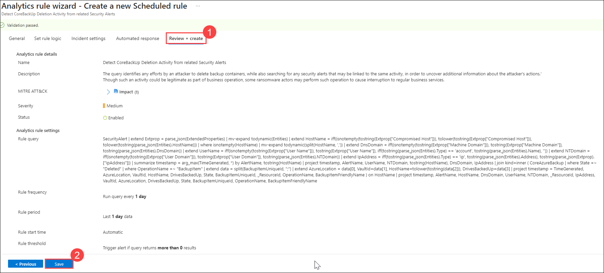 

1. Return to the Sentinel page by selecting Microsoft Sentinel then select **Content hub** at the top of the page, above where it says **Analytics rules**.

    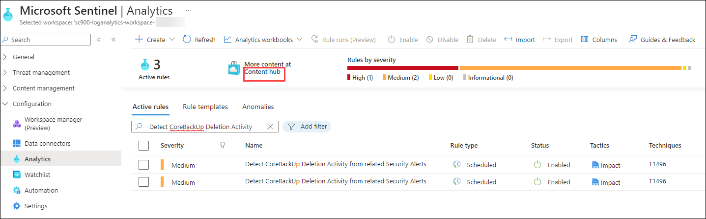 

1. Keep this page open, as you'll use it in the next task.

## Task 4 : Explore on capabilities available in Sentinel

In this task, you'll walk through some of the options available in Sentinel.

1. From the left navigation panel, expand **Threat management** and explore the options listed in threat management.

1. Select **Incidents**, Although no incidents are found, review the **What is it?** section.

    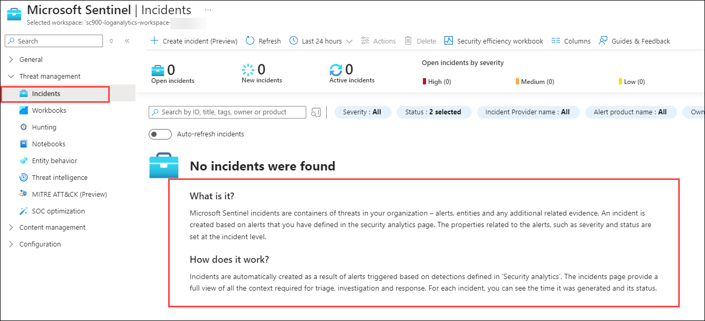 

1. Select **Hunting (1)**, then review the information provided in the **Hunts (Preview) (2)** tab.    

    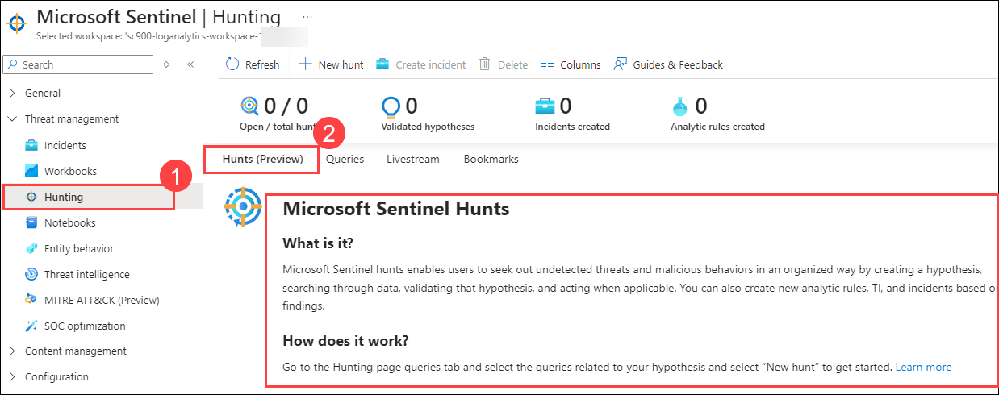 

1. Select **Notebooks**, and review the the **What is it?** section.

     

1. Select **Threat intelligence** and review the information on the page.    

    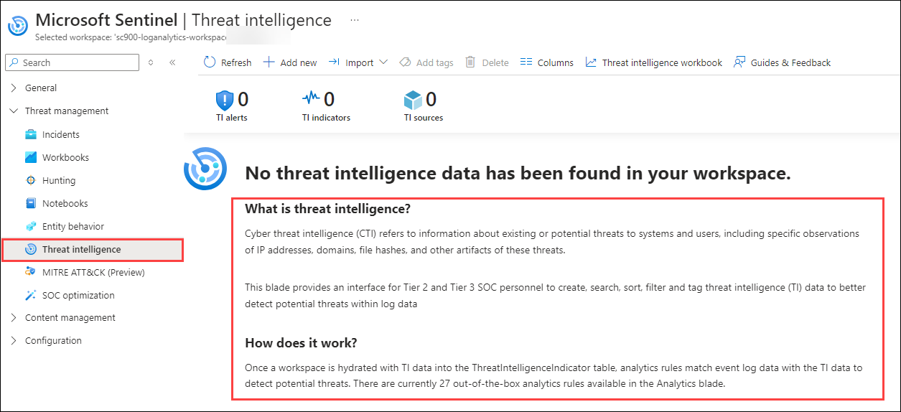 
   
1. From the left navigation panel, select **MITRE ATT&CK (Preview) (1)**. MITRE ATT&CK is a publicly accessible knowledge base of tactics and techniques that are commonly used by attackers. With Microsoft Sentinel you can view the detections already active in your workspace, and those available for you to configure, to understand your organization's security coverage, based on the tactics and techniques from the MITRE ATT&CK® framework. *Select any cell from the matrix* **(2)** and note the information available on the right side of the screen **(3)**.

   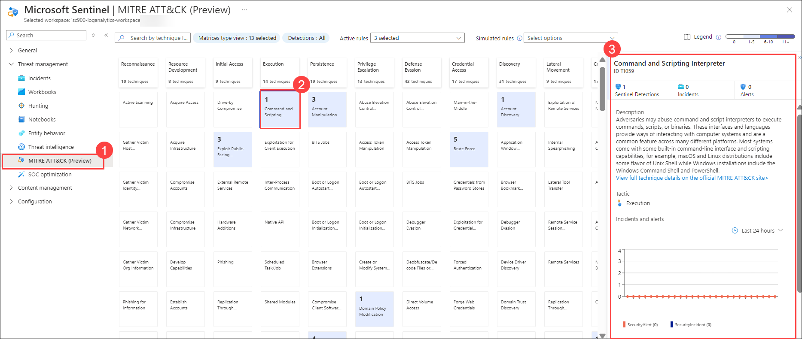

   >**Note**: You may need to select the "**>>**" at the far-right side of the window to see the information panel.

1. From the left navigation panel, expand **Content Management**, then select **Community**. The community page includes *Cybersecurity insights and updates from Microsoft Research, a link to a list of Microsoft Sentinel Blogs, a link to Microsoft Sentinel Forums, links the the latest editions to the Microsoft Sentinel Hub, and more*. Explore this as well.

    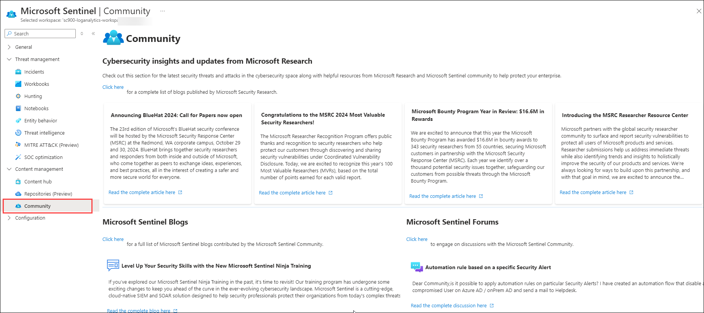 

1. From the left navigation panel, select **Analytics (1)**.  Select the first item from the list **Advanced Multistage Attack Detection (2)**.

    >**Note**: The detailed information.  Microsoft Sentinel uses Fusion, a correlation engine based on scalable machine learning algorithms, to automatically detect multistage attacks (also known as advanced persistent threats) by identifying combinations of anomalous behaviors and suspicious activities that are observed at various stages of the kill chain. On the basis of these discoveries, Microsoft Sentinel generates incidents that would otherwise be difficult to catch **(3)**.

    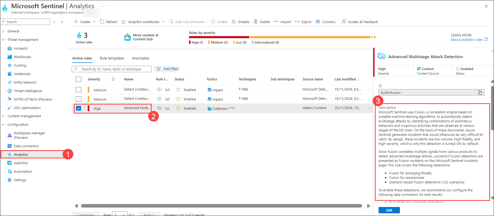     
    
    >**Note**: You may need to select the "**>>**" at the far-right side of the window to see the information panel.

1. From the left navigation panel, select **Automation (1)** under *Configuration*.  Here you can create simple automation rules, integrate with existing playbooks, or create new playbooks.  Select **+ Create (2)** dropdown, and then select **Automation rule (3)**. Note the window that opens on the right side of the screen and the options available to create conditions and actions.  Select **Cancel (4)** from the bottom of the screen.
 
    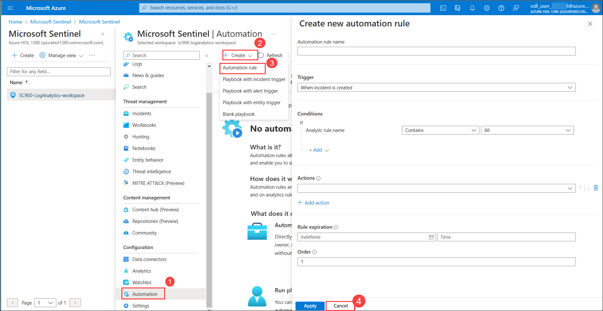
    
## Review
In this lab, you have completed:
- Creating a Microsoft Sentinel instance
- Built-in Microsoft Sentinel roles
- Data connector to your instance of Microsoft Sentinel
- Explored on capabilities available in Sentinel

## You have successfully completed the lab

