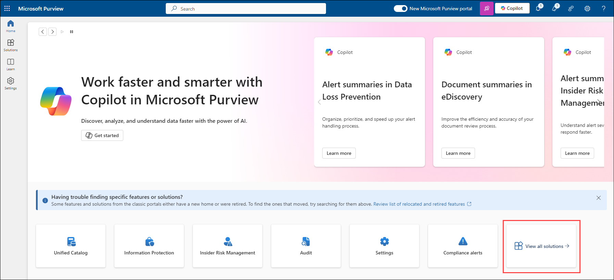
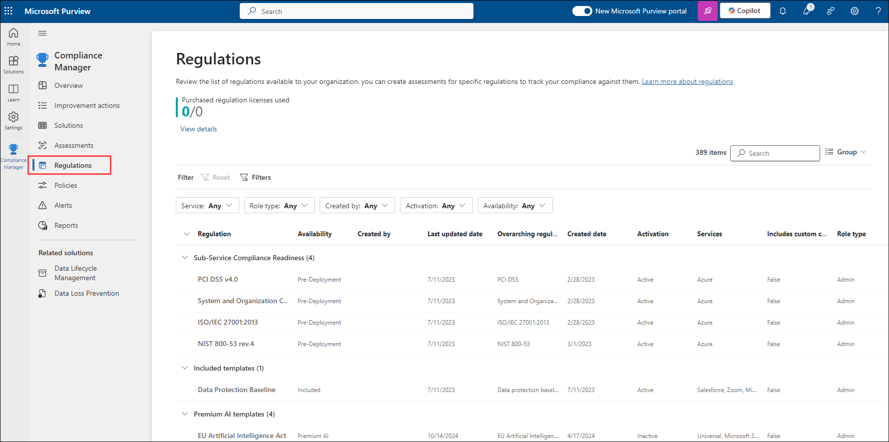

# Lab-12: Explore the Microsoft Purview portal and Compliance Manager

## Lab scenario
In this lab, you will explore the Microsoft Purview compliance center home page and ways in which the capabilities of Compliance manager can help organizations improve their compliance posture.

## Lab objectives

In this lab, you will complete the following tasks:

+ Task 1: Explore the Microsoft Purview compliance center
+ Task 2: Compliance posture through Compliance Manager

## Estimated timing: 60 minutes

## Architecture diagram

## Task 1: Explore the Microsoft Purview compliance center
 In this task  you will Explore the Microsoft Purview compliance center home page and learn to customize the card view and the navigation panel.

1. If you not alredy login to admin center, the address bar of Microsoft edge enter **admin.microsoft.com**.

2. Sign in with your admin credentials.
   
3. In the Sign in window enter you will see a login screen, in that enter the following email/username and then click on **Next**. 

    * Email/Username: <inject key="AzureAdUserEmail"></inject>

4. Now enter the password and click on Sign in.
   
   * Password: <inject key="AzureAdUserPassword"></inject>
  
5. When prompted to stay signed-in, select **Yes**. This takes you to the Microsoft 365 admin center page

6. From the left navigation pane of the Microsoft 365 admin center, select **Show all**.

     

7. Under Admin centers, select **Compliance**.  A new browser page opens to the welcome page of the Microsoft Purview compliance center.

     

8. The Compliance portal is expired so click on **Go to new portal** to go to the new Microsoft Purview portal as highlighted in below image.

     
   
9. At the bottom of the page, select the box next to **I agree to the terms of data flow disclosure and Privacy statements**, then select **Get started**.

     
     
10. The card section on the home page shows you, at a glance, how your organization is doing with your compliance posture, what solutions are available for your organization, and more.
   
11. View the information on the landing page. Scroll down to see your compliance posture status, information related to **Know your data**, and more.
   
12. Scroll up and select the tile that says **View all solutions**.
    
     
     
13. Leave the browser tab open.

## Task 2: Compliance posture through Compliance Manager
 In this tak you will learn about your organization’s compliance posture through Compliance Manager.

 1. From the left navigation panel of the Microsoft Purview portal, select **Solutions** and select **Compliance Manager**. Alternatively, you could select the tile for Compliance Manager, under Risk and Compliance.

      

 2. You are on the Overview page. Scroll down to see all the information available on the page. Information on this page includes your compliance score, your points achieved, and Microsoft managed points achieved. You'll see Key improvement actions, Solutions that affect your score and compliance score breakdown by categories.

     >**Note:** If the Compliance Score is shown as zero percentage, try refreshing the page or sign-out and sign-in again.
 
 3. From the left navigation pane, select **Improvement actions**.  These are actions that can improve the organization’s compliance score, points may take up to 24 hours to update.  Notice the available filters.

     

 4. From the list of improvement actions, select **Enable self-service password reset**.  Each improvement action has an overview section along with the details page from which you can select implementation, testing, the related standards and regulatory requirements, and documents.

     

 5. Exit out of this improvement action by selecting **Improvement Actions** from the breadcrumb on the top left of the page. You are now back on the improvement actions page.

     

 6. From the left navigation pane, select **Solutions**. On this page, you'll see how solutions contribute to your score and their remaining opportunity for improvement.

 7. From the left navigation pane, select **Assessments**. On this page you will see the Data Protection Baseline. This is a default assessment Microsoft provides in Compliance Manager for the Microsoft 365 data protection baseline.  This baseline assessment has a set of controls for key regulations and standards for data protection and general data governance. Compliance Manager becomes more helpful as you build and manage your own assessments to meet your organization's particular needs.

     

 8. Select **Data Protection Baseline**. Notice the information available on the progress tab. You can also view status of controls for this assessment, your improvement actions, Microsoft actions.

     

 9. From the left navigation pane, select **Regulations**. This page lists the available templates. You can create assessments for your organization by using an existing template or you can create a new template.

     
 
 10. From the included templates list, Search and select **ISO/IEC 27001:2013** (**Note:-** Search the template in the filter by pasting the name and then press enter in keyboard) from the top right of the page.

     

 11. select **+ Create assessment**.

     

 12. Notice on the left side of the screen that there are only few steps to create an assessment from the template.  Select Cancel from the bottom of the page.

     

 14. Close the open browser tabs.

## Review
In this lab, you have completed:
- Explore the Microsoft Purview compliance center
- Compliance posture through Compliance Manager
  
## You have successfully completed the lab
